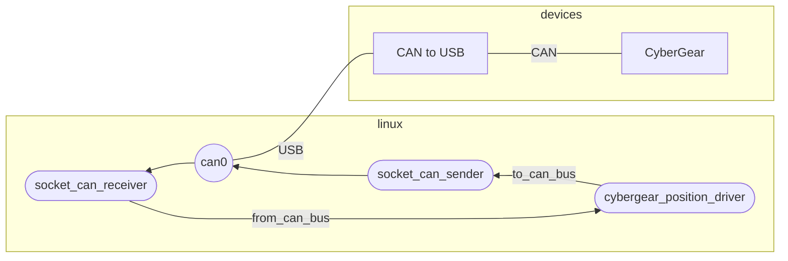

# cybergear_socketcan_driver

This package provides functionality to control CyberGear using CAN frame messages.

The control inputs are compatible with the following:
+ Position control
+ Velocity control
+ Torque control (Current control)


## Basic Usage

To execute position control, run the following command:

```bash
ros2 run cybergear_socketcan_driver cybergear_position_driver_node
```

When launched, it listens for topics as follows:

```bash
/cybergear_position_driver
  Subscribers:
    /from_can_bus: can_msgs/msg/Frame
    /joint_trajectory: trajectory_msgs/msg/JointTrajectory
    /parameter_events: rcl_interfaces/msg/ParameterEvent
  Publishers:
    /cybergear_position_driver/joint_state: sensor_msgs/msg/JointState
    /cybergear_position_driver/temperature: sensor_msgs/msg/Temperature
    /diagnostics: diagnostic_msgs/msg/DiagnosticArray
    /parameter_events: rcl_interfaces/msg/ParameterEvent
    /rosout: rcl_interfaces/msg/Log
    /to_can_bus: can_msgs/msg/Frame
  Service Servers:
    /cybergear_position_driver/describe_parameters: rcl_interfaces/srv/DescribeParameters
    /cybergear_position_driver/enable_torque: std_srvs/srv/SetBool
    /cybergear_position_driver/get_parameter_types: rcl_interfaces/srv/GetParameterTypes
    /cybergear_position_driver/get_parameters: rcl_interfaces/srv/GetParameters
    /cybergear_position_driver/list_parameters: rcl_interfaces/srv/ListParameters
    /cybergear_position_driver/set_parameters: rcl_interfaces/srv/SetParameters
    /cybergear_position_driver/set_parameters_atomically: rcl_interfaces/srv/SetParametersAtomically
    /cybergear_position_driver/zero_position: std_srvs/srv/Trigger
```

Calling the `~/enable_torque` service toggles the torque of the CyberGear on or off.
Sending a `/joint_trajectory` topic executes position control.
Please refer to the parameters for the joint names at this time.


## Environment
The intended operating environment on the following:




## Dependencies

In addition to the ROS 2 core packages, this package depends on the following:

+ [generate_parameter_library](https://github.com/PickNikRobotics/generate_parameter_library)
+ [ros2_socketcan](https://github.com/autowarefoundation/ros2_socketcan)


## Control Mode

The command values transmitted to CyberGear for each node are shown below.

+ `cybergear_default_driver_node`

  position, velocity, effort

+ `cybergear_position_driver_node`

  position

+ `cybergear_velocity_driver_node`

  velocity

+ `cybergear_torque_driver_node`

  effort


## Parameters

Please refer to [node_parameters.md](node_parameters.md) for the parameters.

